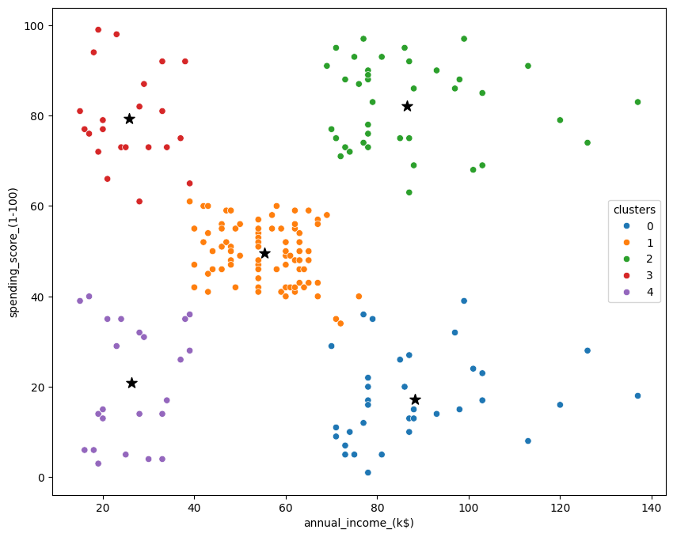

# Clustering customers into groups

## Problem Definition

Customer segmentation plays a vital role in marketing and business strategy by dividing a customer base into unique groups based on specific characteristics. The main goal of this project is to create a robust customer segmentation model using clustering algorithm K-means. This model will classify customers according to factors such as age, Income, spending habits, and gender. 

The business goals of the project:
- Identify high-value customer segments for personalized and targeted marketing campaigns.
- Improve customer engagement and retention by addressing the unique needs of each segment.
- Optimize resource allocation by concentrating on the most profitable segments.

## Dataset
Dataset was acquired from kaggle.com [Available here](https://www.kaggle.com/datasets/vjchoudhary7/customer-segmentation-tutorial-in-python)

Dataset consists of:
- 200 rows of unique customer data
- Columns for age, gender, annual income and spending score

## Strategies for data anaysis

- Data cleaning
- Distribution plots 
    - Visualizes the distribution of the data on various variables
    - Identifies outliers and data skewness and differences between genders
- Boxplots
    - Comparison of age, income and spending across genders
    - Identifies trends and differences between genders
- Pairplots
    - Visualizes the relationship between variables and gender
- Heatmaps
    - Identifies correlation between variables

## Clustering using K-means
- Calculate inertia scores and plot them to determine the optimal cluster count using the Elbow Method
- K-Means Clustering with 5 clusters using Annual Income and Spending Score to group customers

## Results

- The most optimal segmentations show highlights five distinct customer clusters:
    - Low Income, Low Spending (Purple Cluster): Cost-conscious shoppers with limited spending capacity.
    - High Income, Low Spending (Blue Cluster): High-income individuals who spend conservatively, suggesting a value-focused approach.
    - Moderate Income, Moderate Spending (Orange Cluster): Represents the middle-income, moderate-spending segment, typical of average mall customers.
    - Low Income, High Spending (Red Cluster): Lower-income customers with high spending, likely aspirational or impulsive buyers.
    - High Income, High Spending (Green Cluster): Wealthy customers with high spending potential, ideal targets for luxury marketing.

### Customer segmentation into 5 clusters
